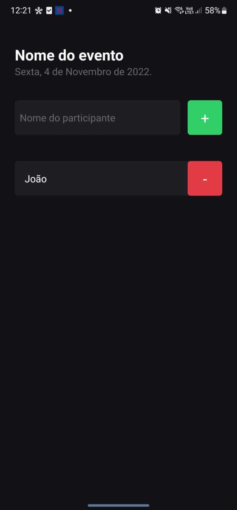

# React-Native-basics
This is gonna be a repository where I'm gonna share the basic fundamentals of React Native framework. Please, fell free to share comment or improve the knowledge you'll find here 🚀📱 

# What is React Native ?

React Native is a framework to develop cross-platform applications for IOS and Android operating systems using JavaScript.

# Expo vs CLI
There are two different ways to approach a React Native application.

### CLI
If you intend to use an emulator to see how your application behaves, especially when using an emulator for iOS (you'll need a Mac for it), I'd say that the CLI is your path to getting into React Native development. Also, there is a lot of emulator-related stuff to configure going this way, so I recommend this path __if you really need to use emulators__.

### Expo
If you're a super laid-back coder who just wants to keep things chill and test both Android and iOS systems (you'll need an iOS mobile device for it) with your own hands, then Expo is the right vibe for you. All you gotta have is the __Expo app on your smartphone and Node.js__.

# Expo Managed workflow vs Bare workflow
### Managed workflow
Ideal for developers who want a quick setup, __don't require extensive native modules__, and prioritize ease of development over custom configurations.

### Bare workflow
Suitable for projects that require __more control over the native code__, need access to specific native modules, or have dependencies that are not supported in the Expo SDK.

# Basic tags on React Native

### Text
Alright, let's talk about the \<Text> tag in React Native. This bad boy is your go-to for displaying text on your app. It's like the guy you call when you need to show words, headings, or paragraphs. It's kinda like the \ or \
 tags in web dev, but tuned up for React Native goodness. Perfect for making your app speak with style!

### View
So, in React Native, the 'View' thing is like your go-to Lego block for setting up and arranging stuff on your app screen. It's kind of like the __\
__ you use in web development to group things together. Basically, it's your container buddy – toss in some components, and it helps you keep things organized and looking good on the screen. Easy peasy!

# Project I'm Here

### Description
This project is a simple solution for a list of participants that were invited for an event. You basically can add and remove participants.

### What I learned
- Inline styling
- StyleSheet styling
- TextInput
- TouchableOpacity
- Components
- Components Props
- ScrollView
- FlatList
- StatusBar
- Alert
- States (useState)
- prevState

### Screens

